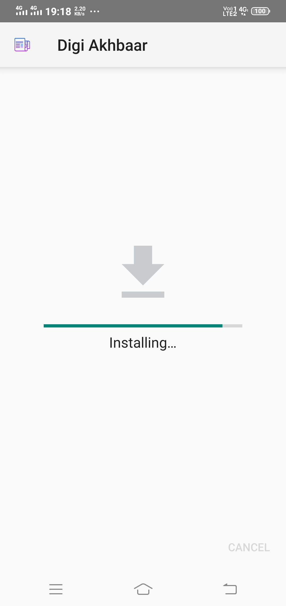
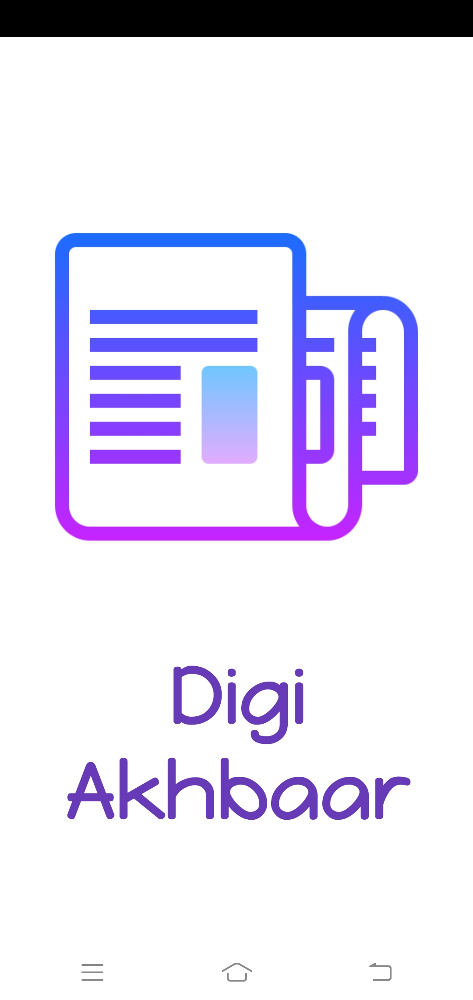
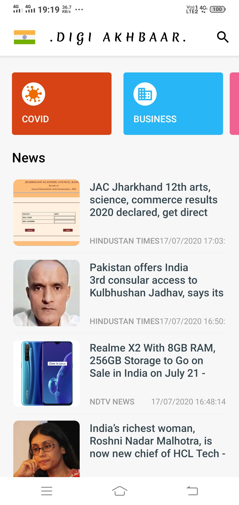
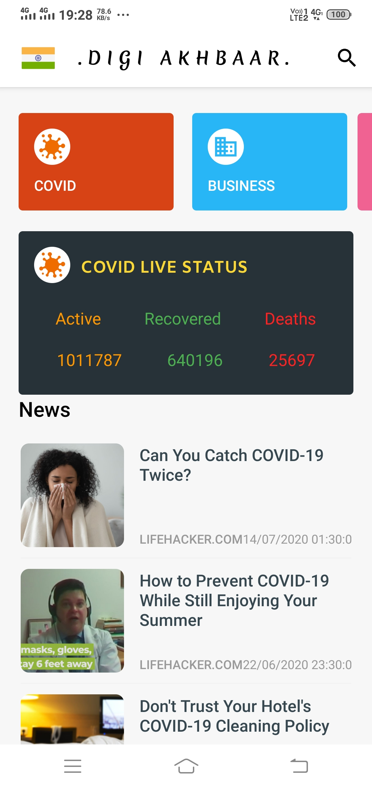
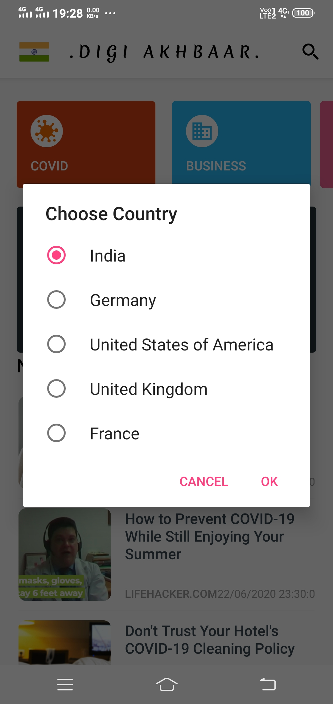

# Digi-Akhbaar
_____________________________________________________
**A multi-lingual news app.**

Keeping everyone updated with all kinds of news is the concept behind my application. The goal is to create a News Feed app that gives a user regularly-updated news from the internet related to a particular topic, person, or location. In this project, I have used the News API. This is a well-maintained API that returns information in a JSON format. 
"Digi Akhbaar" as the name implies means "A Digital newspaper". The "Digi Akhbaar App" comes up with many exciting features. 

## Features

1.) A very simple user-friendly UI that can be handled easily by a layman.

2.) Five different countries' news is currently available in the app. The countries are India, Germany, the USA, the UK, and France.

3.) With the change of country or region, the language of the news also changes. For example: For Germany news, the app will automatically turn into german.

4.) Get live COVID updates of respective countries within the app.

5.) Users can search for any news using the search bar.

6.) Usage of retrofit and news API makes news feed appear both quickly and with less traffic.

7.) Fast and secure browsing of news is available in the app itself. Users can view the complete news within the app itself.

8.) The app is completely available for all android versions starting from Android 4.0 to Android 10.0, satisfying 98.1 % of the whole world users.

9.) Users can browse the news based on categories like Entertainment, business, etc.

10.) The app size is around 5mb which makes the user not spend much data to download.

11.) Above all the benefits the app is really fast and easy to handle. 

## Application Architecture

* IDE: Android Studio
* API: News API
* Architecture: MVVM
* Programming Language: Java
* Third-Party Libraries: Retrofit, Glide, ButterKnife, Gson
* Libraries used: DataBinding, ViewModel, Recycler View, Material Design, LiveData.

## Screenshots

  

  

## Links:
* [Download App](https://drive.google.com/file/d/1AnlIN5UKRt6ER4EvITfpBk6UYFcx1khY/view?usp=sharing)
